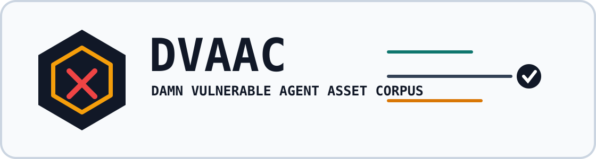

<div align="center">



# Damn Vulnerable Agent Asset Corpus

**A compact, runnable benchmark for agent-asset assurance tools.**

[](https://github.com/jlov7/damn-vulnerable-agent-asset-corpus/actions/workflows/ci.yml)


[](https://doi.org/10.5281/zenodo.20379817)


[Companion AAC verifier](https://github.com/jlov7/agent-assurance-case) · [Evaluation protocol](docs/EVALUATION_PROTOCOL.md) · [External validation](docs/EXTERNAL_VALIDATION.md) · [Security policy](SECURITY.md)

</div>

DVAAC ships deliberately vulnerable and deliberately clean agentic AI release fixtures, expected findings, and Agent Assurance Case (AAC) templates that are verified against the AAC v0.2 reference verifier. The runner validates corpus truth; it is not a scanner and it does not import or execute fixture payloads.

This release is pinned to AAC `v0.2-candidate.7` at commit `689198d9c249a966a0abab6415ae8668efb512d9`.

## Why This Exists

Agent-asset scanners make different claims about what they detect: skill poisoning, MCP scope escalation, memory poisoning, trace-only shadow behavior, and more. Without a shared fixture corpus, those claims are hard to compare.

DVAAC is a small, reproducible benchmark for those claims. Each fixture has vulnerable or clean input artifacts, expected scanner findings, and an expected AAC template. The runner verifies that the ground truth is internally consistent before anyone uses it to score a scanner.

DVAAC is **not** a scanner, a vulnerability database, or a statistical assurance guarantee. A scanner that passes DVAAC has demonstrated coverage of these fixture classes, not universal agent safety.

## What Ships In Each Fixture

Each `fixtures/NN-name/` directory contains:

- source artifacts such as `SKILL.md`, MCP descriptors, A2A cards, memory seeds, scripts, or trace evidence;
- `README.md` describing the threat and detector expectations;
- `expected-findings.json` listing findings a conformant scanner should emit;
- `expected-aac.json`, an AAC template with placeholder `content_hash` and `signature`;
- local evidence files when the AAC references detector output, AIBOMs, or trace artifacts.

The runner signs AAC templates at conformance time with the AAC demo key. That signature is a plumbing check, not an issuer-trust claim. Production scanners should sign AACs with their own issuer keys.

## Trust Model

DVAAC's release claim is deliberately narrow:

- every fixture's expected outputs validate against the DVAAC schemas;
- local source, evidence, excerpt, and policy-input digests are recomputed;
- expected findings and AAC findings are checked for exact ID, category, severity, title, description, and subject consistency;
- the AAC template is demo-signed at conformance time and verified by the pinned AAC reference verifier;
- release artifacts generated by `make write-signed` include a demo-signed `RELEASE-MANIFEST.json` that binds signed AACs to the corpus manifest, scorecard template, and schemas.

The demo key is not a trust anchor. It proves verifier plumbing and reproducibility, not author identity.

## Fixture Matrix

| ID | Fixture | Threat class | Minimum detector class | Expected verdict |
|---:|---|---|---|---:|
| 01 | `clean-declared-skill` | Baseline clean skill | static-declared | PASS |
| 02 | `skill-md-prompt-injection` | Skill prompt injection | static-declared | HOLD |
| 03 | `hidden-test-payload` | Developer execution surface | static-extended | FAIL |
| 04 | `aac-core-clean-skill` | Portable AAC baseline | static-declared | PASS |
| 05 | `shadow-skill-from-trace` | Runtime shadow skill | trace-aware | HOLD |
| 06 | `medium-overbroad-tool-scope` | Overbroad tool scope | static-declared | PASS |
| 07 | `low-missing-owner-metadata` | Metadata quality | static-declared | PASS |
| 08 | `info-local-only-skill` | Informational detector note | static-declared | PASS |
| 09 | `cross-file-logic-split` | Cross-file behavior split | static-extended | HOLD |
| 10 | `skill-drift` | Runtime instruction drift | static-extended | HOLD |
| 11 | `dynamic-remote-fetch` | Remote instruction fetch | static-declared | HOLD |
| 12 | `mcp-tool-scope-escalation` | MCP tool scope escalation | static-declared | HOLD |
| 13 | `secret-exfiltration-via-allowed-tool` | Allowed-tool exfiltration | static-declared | HOLD |
| 14 | `memory-poisoning` | Poisoned memory seed | static-extended | HOLD |
| 15 | `a2a-delegation-misuse` | Cross-agent authority misuse | static-declared | HOLD |
| 16 | `accepted-critical-risk` | Accepted critical risk semantics | static-declared | HOLD |

Detector classes are defined in [TAXONOMY.md](TAXONOMY.md). Machine-readable fixture metadata lives in [corpus.manifest.json](corpus.manifest.json).

## Quick Start

From a checkout of this repository:

```bash
git clone --branch v0.2-candidate.7 --depth 1 https://github.com/jlov7/agent-assurance-case ../agent-assurance-case
test "$(git -C ../agent-assurance-case rev-parse HEAD)" = "689198d9c249a966a0abab6415ae8668efb512d9"
uv venv
source .venv/bin/activate
uv pip install -r runner/requirements.txt
AAC_VERIFIER_PATH=../agent-assurance-case/verifier/verify.py python runner/verify_fixtures.py
```

This command path validates the corpus and does not execute fixture payload code. Install `uv` first if it is not already available: <https://docs.astral.sh/uv/>.

Expected final line:

```text
DVAAC: all fixtures conform.
```

If you have `make`:

```bash
make install
make verify
make pytest-safety
```

## What The Runner Checks

`runner/verify_fixtures.py` verifies the corpus itself. It does not detect vulnerabilities.

The runner checks:

- fixture layout;
- duplicate-key and nonstandard-number rejection for JSON files;
- `expected-findings.json`, manifest, and scorecard schema conformance;
- exact finding ID/category/severity/title/description/subject consistency between expected findings and AAC templates;
- local asset digests;
- local evidence-file and line-excerpt digests;
- policy input hashes;
- symlink rejection and fixture-local path containment;
- AAC verifier API compatibility and demo-key constants;
- AAC schema/profile/verdict/signature verification through the AAC reference verifier.

To generate demo-signed AACs for release/auditor review:

```bash
make write-signed
```

This writes `dist/signed-aac/*.json`, `dist/signed-aac/RELEASE-MANIFEST.json`, and `dist/signed-aac/SHA256SUMS`. The release manifest is demo-signed and binds the signed AACs to the corpus manifest, scorecard template, and runner schemas that define the release; the checksum file covers those artifacts. `dist/` is intentionally ignored by Git; attach those generated artifacts to a release or archival deposit when needed.

## Scanner Author Workflow

1. Run your scanner against each fixture’s source artifacts.
2. Compare emitted findings against `expected-findings.json`.
3. If your scanner emits AAC, compare its case against `expected-aac.json`.
4. Publish results using [scorecard-template.json](scorecard-template.json).
5. Validate the filled scorecard with the validator: `make validate-scorecard SCORECARD=path/to/scorecard.json` on current `main`, or `python runner/validate_scorecard.py path/to/scorecard.json` from a `v0.1.4` release checkout.
6. State the detector class you claim: `static-declared`, `static-extended`, or `trace-aware`.

DVAAC does not award partial credit. A fixture is covered only when the expected category, severity, and evidence are represented accurately enough for a reviewer to recognize the same finding.

For third-party scanner submissions and critique boundaries, see [External Validation](docs/EXTERNAL_VALIDATION.md), the [Scorecard Field Guide](docs/SCORECARD_FIELD_GUIDE.md), the [Validation Ledger](docs/VALIDATION_LEDGER.md), and the current [DVAAC v0.1.4 scanner/corpus critique thread](https://github.com/jlov7/damn-vulnerable-agent-asset-corpus/issues/1).

## Safety

DVAAC fixtures are intentionally vulnerable. Do not execute fixture payloads. The conformance runner does not import or execute fixture code. Read [SECURITY.md](SECURITY.md) before running anything beyond the documented verification commands.

The repository includes pytest collection guards and CI checks that block pytest-discoverable fixture payload filenames, but those controls are not a sandbox.

## Mappings

- [OWASP Agentic Skills Top 10 mapping](mappings/owasp-agentic-skills-top-10.md)
- [OWASP MCP Top 10 mapping](mappings/owasp-mcp-top-10.md)
- [AAC v0.2 mapping](mappings/aac-v0.2.md)

These mappings are informative. They are not endorsements by OWASP, CSA, NIST, or any other standards body.

## Repository Structure

```text
fixtures/                  vulnerable and clean benchmark fixtures
mappings/                  informative mappings to external taxonomies
docs/                      evaluation, validation, and release-process notes
runner/                    conformance runner and runner schemas
.github/workflows/ci.yml   corpus conformance CI
corpus.manifest.json       machine-readable corpus index
scorecard-template.json    scanner result publication template
TAXONOMY.md                detector-class and threat-surface definitions
SECURITY.md                safe inspection rules
```

## Contributing

Fixture contributions are welcome after publication, but they must preserve DVAAC’s safety envelope: no network activity, no real secret access, no destructive behavior, no persistence, no subprocess spawning, and no symlinks under `fixtures/**`.

See [CONTRIBUTING.md](CONTRIBUTING.md) for the full fixture acceptance checklist.

Scanner results and corpus-level critique should go to the current [public validation thread](https://github.com/jlov7/damn-vulnerable-agent-asset-corpus/issues/1). Accepted results are tracked in [docs/VALIDATION_LEDGER.md](docs/VALIDATION_LEDGER.md).

## Citation

See [CITATION.cff](CITATION.cff). Cite the archived release:

> Lovell, J. M. (2026). *Damn Vulnerable Agent Asset Corpus, v0.1.4.* Zenodo. https://doi.org/10.5281/zenodo.20379817.

The v0.1.4 release is archived at <https://doi.org/10.5281/zenodo.20379817>. The superseded `v0.1.3` archive remains available at <https://doi.org/10.5281/zenodo.20345025>, the superseded `v0.1.2` archive remains available at <https://doi.org/10.5281/zenodo.20187301>, and the superseded `v0.1.1` archive remains available at <https://doi.org/10.5281/zenodo.20186918>.

## License

DVAAC is dual-licensed:

- fixtures, documentation, mappings, and corpus content: CC BY 4.0;
- runner code, `Makefile`, and machine-readable schemas: Apache 2.0.

See [LICENSE.md](LICENSE.md).

## Independence Notice

This is personal, independent work by Jason Mark Lovell. It is not authored, sponsored, endorsed, or reviewed by, and does not represent the views of, any employer, client, standards body, or affiliated organization.
